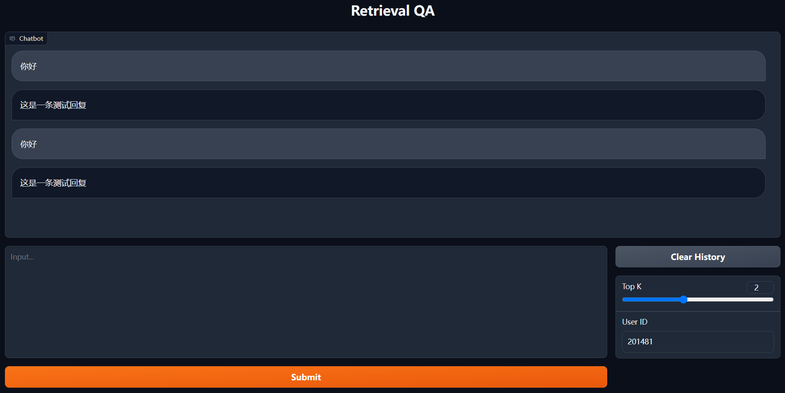
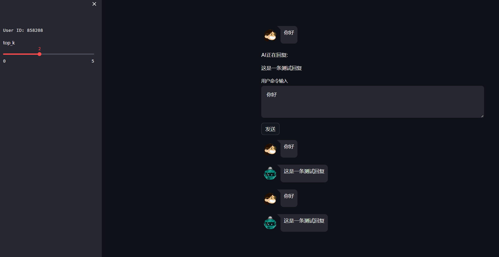

# Retrieval QA

基于大模型的检索增强的问答系统框架

## 大模型部署

- 非流式
  [api_llm.py](standard/api_llm.py)
- 流式
  [api_llm_stream.py](stream/api_llm_stream.py)

```shell
python standard/api_llm.py --port 1707 --cuda_id 0 --model_path 'baichuan-inc/Baichuan2-13B-Chat' --quantize False
python stream/api_llm_stream.py --port 1708 --cuda_id 0 --model_path 'baichuan-inc/Baichuan2-13B-Chat' --quantize False
```

## 后端部署

- 非流式
  [app.py](standard/app.py)
- 流式
  [app_stream.py](stream/app_stream.py)

```shell
python standard/app.py --port 1705 --url_retrieval 'http://127.0.0.1:1709/' --url_llm 'http://127.0.0.1:1707/'
python stream/app_stream.py --port 1705 --url_retrieval 'http://127.0.0.1:1709/' --url_llm 'http://127.0.0.1:1708/'
```

## 检索部署

### BM25 检索
- ES 创建 index
  [create_index.py](retrieval/BM25/create_index.py)
- ES index 存数据
  [save_data.py](retrieval/BM25/save_data.py)

```shell
python retrieval/BM25/index.py --index_name 'my_index'
python retrieval/BM25/save_data.py --index_name 'my_index' --file_path 'my_file.json'
```

- ES search 部署
  [es_search_app.py](retrieval/BM25/es_search_app.py)

```shell
python retrieval/BM25/es_search_app.py --port 1709 --index_name 'my_index'
```

### 向量检索（以 BGE 模型为例）

- 构建 index
  [index.py](retrieval/BGE/index.py)

```shell
python retrieval/BGE/index.py --model_path 'BAAI/bge-large-zh-v1.5' --index_path 'faiss.index' --file_path 'my_file.json'
```

- BGE search 部署
  [search_app.py](retrieval/BGE/search_app.py)

```shell
python retrieval/BGE/search_app.py --model_path 'BAAI/bge-large-zh-v1.5' --index_path 'faiss.index' --file_path 'my_file.json' --port 1710
```

## 文件处理

- pdf 处理 [pdf2word.py](read_file/pdf2word.py)

将 pdf 转成 docx 文件。

```shell
python pdf2word.py --pdf_path 'xxx.pdf' --docx_path 'xxx.docx'
```

- word 处理 [word2list.py](read_file/word2list.py)

读取 docx 文本，按照换行进行切片。

```shell
python word2list.py --docx_path 'xxx.docx' --output_path 'xxx.json' --max_length 500
```

## Demo

### 命令行 demo

- [cli_demo.py](demo/cli_demo.py)

```shell
python demo/cli_demo.py --url_retrieval 'http://127.0.0.1:1709/' --url_llm 'http://127.0.0.1:1708/' --top_k 2
```

### 网页版 demo v1
仿照 [ChatGLM](https://github.com/THUDM/ChatGLM-6B) 实现了基于 [Gradio](https://www.gradio.app/) 的网页版 Demo。
运行前请先部署好 [app_stream.py](stream/app_stream.py)



- [web_demo.py](demo/web_demo.py)

```shell
python demo/web_demo.py --url_app_stream 'http://127.0.0.1:1704/get'
```

### 网页版 demo v1

基于 Streamlit 的网页版 Demo



- [web_demo2.py](demo/web_demo2.py)

```shell
streamlit run demo/web_demo2.py --server.port 6006
```

## Todo

- [x] 多轮对话，问题重构
- [x] 流式输出
- [x] web demo
- [x] web demo2
- [x] ES 检索
- [x] pdf, word, txt 格式数据读取及解析
- [x] 向量检索
- [x] 命令行 demo
- [ ] 接口文档模版

## 支持的大模型

- Baichuan

## 请求示例

- 非流式
```python
import requests
import random

url = "http://127.0.0.1:1705/get"
data = {
    "query": "你好",
    "id": random.randint(0, 9999999)
}
res = requests.post(url, json=data)
print(res.content)
```

- 流式
```python
import requests
import random

data = {
    "query": "你好",
    "id": random.randint(0, 9999999)
}
response = requests.post("http://127.0.0.1:1705/get", json=data, stream=True)
if response.status_code == 200:
    buffer = b''
    # 逐字节接收数据
    for byte in response.iter_content(1):
        buffer += byte
        try:
            # 尝试解码成 UTF-8 字符串
            decoded_chunk = buffer.decode('utf-8')
            # 处理解码后的字符串，例如打印
            print(decoded_chunk, end='', flush=True)
            # 清空缓冲区
            buffer = b''
        except UnicodeDecodeError:
            # 如果解码失败，继续接收字节
            pass
```